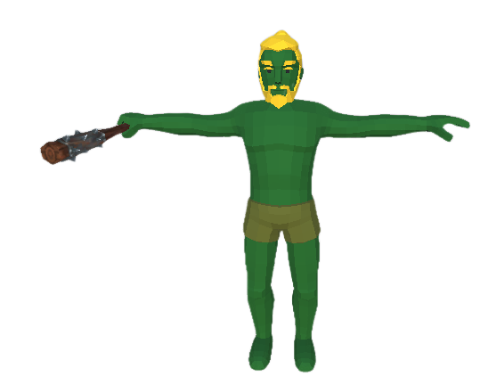
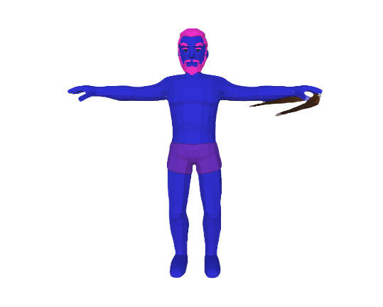
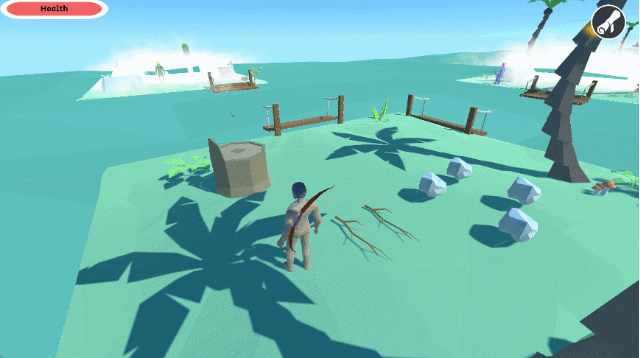
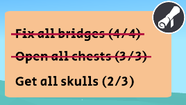

# Treasure of the Sea

## 목차
- [소개](#개요)
- [기술 스택](#기술-스택)
- [주요 기능](#주요-기능)
- [기여 및 역할](#기여-및-역할)

## 개요
- Treasure of the Sea는 활 전투, 제작, 탐험 요소를 결합한 3D 액션 어드벤처 게임입니다.
섬을 복구하고 보스를 물리치는 것이 목표입니다.

- **개발 기간:** 2022.05 ~ 2022.07
- **개발 인원:** 2인 (Gameplay Programmer 1명, AI Programmer 1명)
- **담당 역할:** 게임플레이 프로그래머

## 기술 스택
- 엔진: Unity Engine(2021.1.10f1)
- 언어: C#

## 주요 기능

+ 활을 이용한 전투
    - **조준 시스템**: 활을 사용할 때 화면이 자동으로 줌되며, 중앙 크로스헤어를 기준으로 화살이 정확히 발사됩니다.

<table>
  <tr>
    <td></td>
    <td></td>
  </tr>
</table>

+ 근·원거리 적 AI 전투:     
    + 두 종류의 적이 각자 지정된 구역에서 탐색 및 공격 행동을 수행합니다.
    + 플레이어를 인식하지 못하면 주변을 순찰하고, 인식 시에는 추적 및 공격을 개시합니다.

- **인벤토리 제작 시스템**: 플레이어는 획득한 아이템을 저장하고 조합하여 퀘스트에 필요한 아이템을 제작할 수 있습니다.

<table>
  <tr>
    <td></td>
    <td></td>
  </tr>
</table>

- **퀘스트 시스템**: 다리 복구 등 다양한 목표를 수행할 수 있으며, 진행 상황은 퀘스트 인터페이스를 통해 확인할 수 있습니다.

## 기여 및 역할
- 인벤토리·제작·퀘스트 간 데이터 참조 구조 통합 및 UI 동기화 설계  
- 퀘스트, 제작, 인벤토리, HP 바 등 주요 UI 제작 및 데이터 연동  
- 이벤트 기반 상호작용, UI 전환 애니메이션, 파티클 연출 등 플레이 완성도 향상 요소 구현
